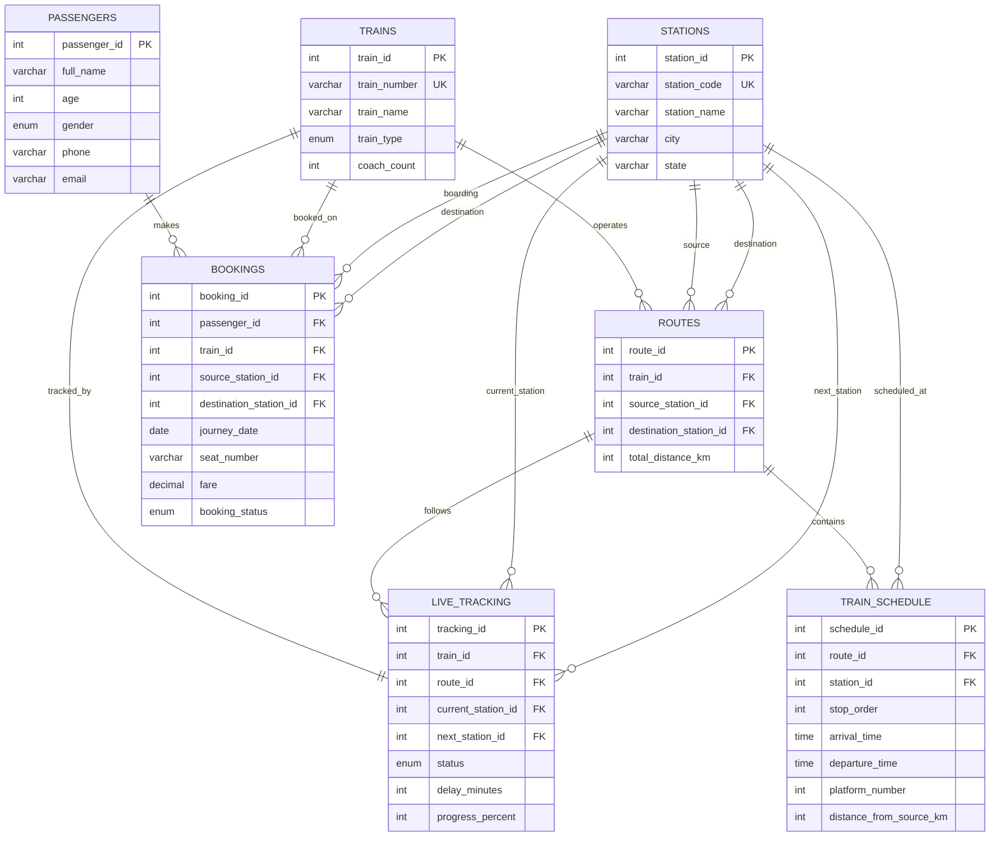

# ER Diagram and Relationship Explanation

## ER Diagram

## Relationships

- One train can operate one or more routes.
- One route has one source station and one destination station.
- One route has many schedule stops through `train_schedule`.
- One station can appear in many schedules, routes and bookings.
- One train has one current live tracking record.
- One passenger can make many bookings.
- One booking belongs to one passenger and one train.
- Source and destination station IDs in `bookings` identify the passenger journey.

## Constraints Used

- Primary keys on every table.
- Unique train numbers and station codes.
- Foreign keys for all relationships.
- Check constraints for coach count, platform number, fare, distance and progress.
- Unique seat constraint for one train, one journey date and one seat number.
